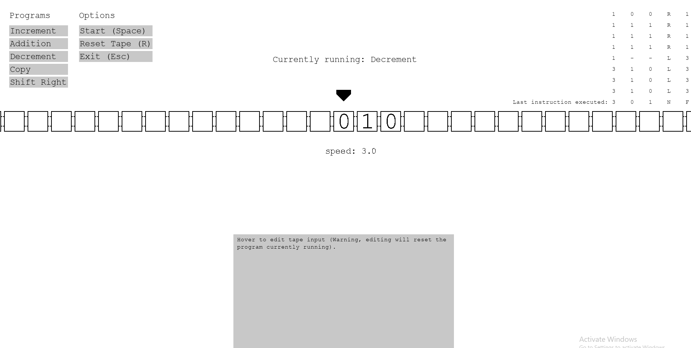

# Turing Machine Simulator

## Theory

This program offers a visual representation of Alan Turing's *a-machine*, which can be understood as the most stripped-down, simple computer imaginable. His major work was to prove that the set of operations capable on **any** computer is no greater than the set of operations capable on such a simple machine. In other words, computer speed and complexity (including such things as the presence of RAM and other modern components) have no bearing on what kind of operations are computable on the machine (in a theoretical sense, speed is obviously a practical concern). The inverse holds also. If the Turing machine is incapable of running a function, so is every computer. From this, Turing constructed a theory of the limits of standard computing. This is commonly called the Halting Problem, which details the impossibility of a program which computes whether other programs will succeed or run forever. For more reading see [here](https://en.wikipedia.org/wiki/Halting_problem).

The Turing Machine is composed of a tape of infinite length with a head that reads and writes symbols to the currently selected cell of the tape and can shift the tape right or left. The machine operates via a set of preset instructions, determined by the read symbol and the current *state* of the machine. These take the form: **A 0 0 L B**, where **A** and **0** are conditionals representing the state of the machine and read symbol respectively that need to match to execute the instruction. The next **0** is the symbol to write to the selected cell (note this can be the same or different), the **L** indicates the direction the tape should move next and the final **B** is the state the machine should now transition to. Through this basic functionality, all imaginable computer programs can be written.

## Functionality

The program comes with a number of simple programs pre-written, a copy, increment, decrement and addition. 
Each program requires:
* an **alphabet** of valid tape symbols.
* an initial **tape configuration** using these symbols.
* an **alphabet** of valid states for the machine.
* a set of valid instructions.

Using this framework, users can write their own programs for the machine to run. These can be added to the program as a folder in the root folder containing each of the above as a *.txt* document (see the example program folders for clarity).

The program also supports editing the tape, pausing and starting the machine, tracking which instruction is currently being executed and variable running speeds for both quick calculation and slow analysis of the steps involved.
## Demo

The machine is shown here completing one operation, namely the adding of two binary numbers.

## Program Files

These are the files for the increment program.

### Symbol alphabet

> -01

\- is a blank cell on the tape.

### State alphabet

> 0123F

F by convention is the finished state of the program.

### Initial tape configuration

> 0100111

### Instruction set

> 011R0

> 000R1 

> 0-0L2

> 210L2

> 201NF

> 2-1NF

> 111R1

> 100R1

> 1--L3 

> 301NF 

> 310L3

## Logic

The increment program must consider two cases. The first and simplest is that the binary number in question ends with a zero. In this case, the head moves to the end of the number and then replaces said zero with a one. the operation is now complete. For example, the number 100110 incremented gives 100111. The more complex second case exists for binary numbers ending in one or more ones. In this case, the head finds the end of the number then moves left replacing ones with zeroes until it finds a zero which it replaces with a one to complete the operation. For example 100111 incremented gives 101000. The instruction set manages these multiple cases using different states. This is how these programs 'store' information.
